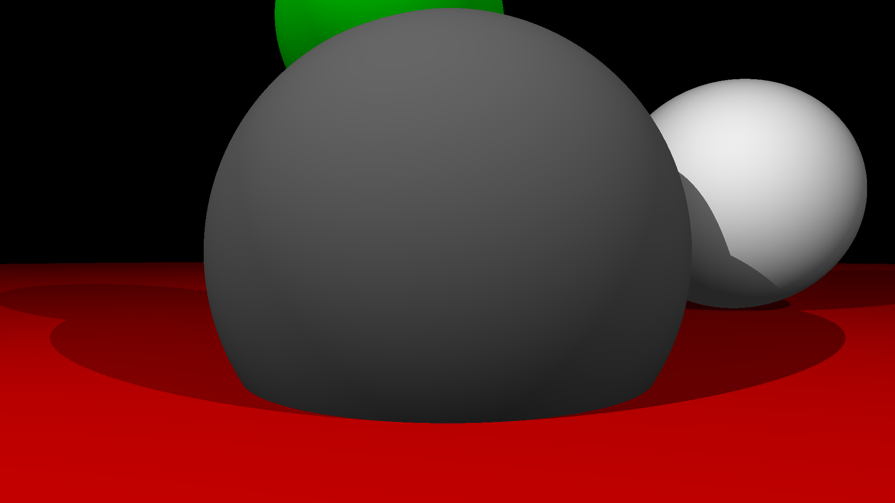

# Raytracing Kumir
Программа для рендера сцен с помощью Ray tracing. Использует только стандартные исполнители

## Как запустить?
1. Скачать и установить КуМир 2 [тут](https://www.niisi.ru/kumir/dl.htm)
2. Скачать и распаковать репозиторий
3. Запустить КуМир-Про (тестировалось в нем, работа в других версиях не гарантируется)
4. Нажать "Загрузить программу..."
5. Выбрать файл Raytracing.kum
6. Настроить (при необходимости)
7. Запустить (кнопка "плей" сверху)

## Как настроить?
В файле Raytracing.kum есть разделы, отмеченные `||`

В разделе "Настройки" находятся все доступные настройки. **!!! НЕЛЬЗЯ ТРОГАТЬ ЗНАЧЕНИЯ В ДРУГИХ РАЗДЕЛАХ !!!**

Сцена настраивается в точке входа. Сумма всех освещений (с учетом Ambient освещения) не должна привышать 100.

X увеличивается **слева-направо**. 0 посередине сцены

Y увеличивается **сверху-вниз**. 0 посередине сцены

Z увеличивается **в сторону зрения камеры**. 0 - точка камеры

Досупные фигуры:
| Фигура | Описание                 |
| ------ | ------------------------ |
| сфера  | Обычная объемная сфера.  |
| лампа  | Точечный источник света. |

### Типы данных 
| Тип  | Описание                  |
| ---- | ------------------------- |
| цел  | Целое число               |
| вещ  | Число с плавающей запятой |
| цвет | Цвет                      |

### Понятия
`Точка входа` - первый алгоритм, без имени

`Runtime переменная` - переменные используемые и изменяемые программой во время выполнения, изменять вручную нельзя

### Планы

- [ ] Отражающие поверхности
- [ ] Матовые поверхности
- [ ] Стеклянные поверхности
- [ ] Направленные источники света (без точки-источника)
- [ ] Цветные источники света
- [ ] Фокусировка и глубина резкости
- [ ] Плоскость (фигура)
- [ ] Загрузка моделей в формате .obj
